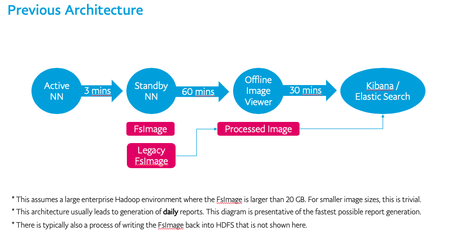
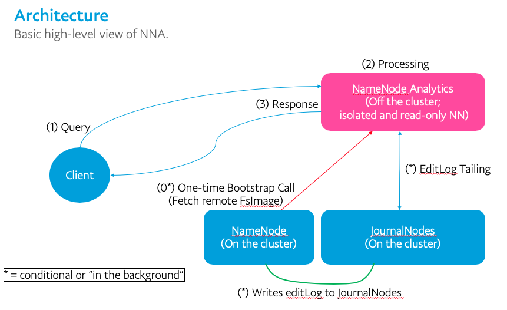

[](http://www.apache.org/licenses/LICENSE-2.0.txt)
[](https://github.com/paypal/NNAnalytics/actions/workflows/gradle.yml)
[](https://nnanalytics.readthedocs.io/en/latest/)
[](https://codecov.io/gh/paypal/NNAnalytics)
[](https://gitter.im/NNAnalytics/Lobby?utm_source=badge&utm_medium=badge&utm_campaign=pr-badge&utm_content=badge)

# 

"A Standby read-only HDFS NameNode, with no RPC server, that services clients over a REST API, utilizes Java 8 Stream API, all for the purpose of performing large and complicated scans of the entire file system metadata for end users."

Run a demo locally and instantly! Just run the following command on a workspace directory:
```
git clone https://github.com/paypal/NNAnalytics.git nna && cd ./nna && ./gradlew -PmainClass=org.apache.hadoop.hdfs.server.namenode.analytics.TestWithMiniClusterWithStreamEngine execute
```
Then go to http://localhost:4567 and you will have an NNA instance complete with a mini HA-enabled HDFS instance all updating in real time on your local machine!

__________________________________________________________________________________________________________________

# Architecture: Legacy vs NNA




__________________________________________________________________________________________________________________

# Documentation & Getting Started

  * [Click here to read the docs](http://nnanalytics.readthedocs.io/)

__________________________________________________________________________________________________________________

# Presentations

  * [SlideShare](https://www2.slideshare.net/PlamenJeliazkov/namenode-analytics-querying-hdfs-namespace-in-real-time)
  * [DataWorks Summit](https://www.youtube.com/watch?v=9xlB5C88tbk)

__________________________________________________________________________________________________________________
